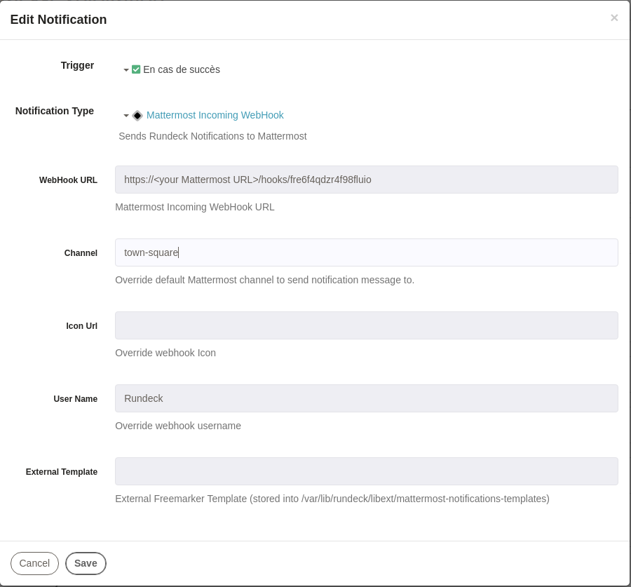
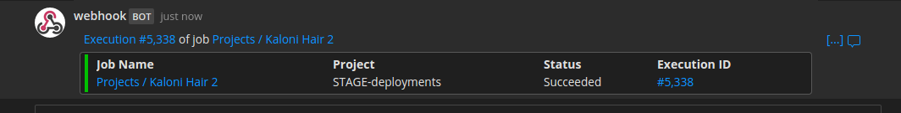

rundeck-mattermost-incoming-webhook-plugin
======================

Sends rundeck notification messages to a mattermost channel.  This plugin  is based on [rundeck-slack-plugin](https://github.com/bitplaces/rundeck-slack-plugin)(based on run-hipchat-plugin).
=======
# Stone Payments - Rundeck Slack Notification Plugin

Sends rundeck notification messages to a slack channel. This plugin is based on [rundeck-slack-plugin](https://github.com/bitplaces/rundeck-slack-plugin)(based on run-hipchat-plugin).

## Build

1. build the source by `gradle`. Run:

## Build
=======
```bash
make build-locally
```

2. copy jarfile to `$RDECK_BASE/libext`

### Build with docker

1. build the source by `docker`. Run:

```bash
make build-docker
```

2. copy jarfile to `$RDECK_BASE/libext`

### Build with docker:
```
$ docker build -t rundeck-mattermost-incoming-webhook-plugin:latest .
$ docker run --rm -v `pwd`:/home/rundeck-mattermost-incoming-webhook-plugin rundeck-mattermost-incoming-webhook-plugin:latest

```
=======
> To generate a new release version for this Plugin, change the `project.version` into the file [`build.gradle`](./build.gradle)

## Installation Instructions

See the [Included Plugins | Rundeck Documentation](http://rundeck.org/docs/plugins-user-guide/installing.html#included-plugins "Included Plugins") for more information on installing rundeck plugins.

## Download jarfile

1. Download jarfile from [releases](https://github.com/rundeck-plugins/slack-incoming-webhook-plugin/releases).
2. copy jarfile to `$RDECK_BASE/libext`

It creates ``build/libs/rundeck-mattermost-0.7.jar``
## Configuration
This plugin uses Mattermost incoming-webhooks. Create a new webhook and copy the provided url.
=======

This plugin uses Slack incoming-webhooks. Create a new webhook and copy the provided url.



The only required configuration settings are:

- `WebHook URL`: Mattermost incoming-webhook URL.
- `Channel`: Mattermost channel *(default = town-square)*
- `Icon URL`: URL of a custom icon
- `User Name`: Notify sender identity *(default = Rundeck )*
- `External Template`: file name of a Freemarker custom template

### Custom template
- Create folder ``/var/lib/rundeck/libext/mattermost-notifications-templates``
- Put your custom ``ftl`` file template into this folder *(ex into mattermost-notifications-templates folder)*

## Mattermost  message example.

=======
## Slack message example

On success.




## Contributors
*  Original [hbakkum/rundeck-hipchat-plugin](https://github.com/hbakkum/rundeck-hipchat-plugin) author: Hayden Bakkum @hbakkum
*  Original [bitplaces/rundeck-slack-plugin](https://github.com/bitplaces/rundeck-slack-plugin) authors
    *  @totallyunknown
    *  @notandy
    *  @lusis
*  @sawanoboly
*  @MatthGyver
*  @sawanoboly
*  @kujiy
